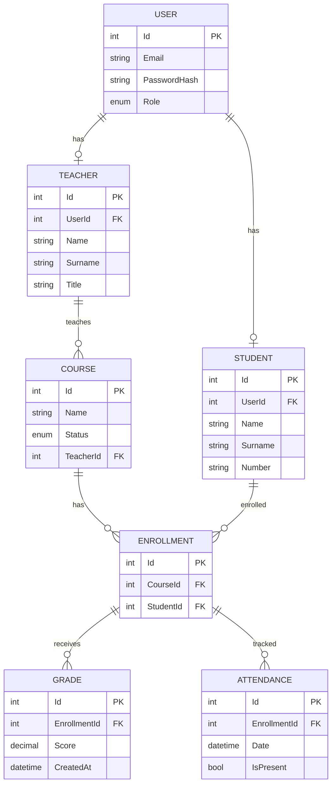

---

#  Öğrenci Otomasyon Sistemi

##  Proje Açıklaması

Bu proje, modern yazılım geliştirme teknolojileri kullanılarak uçtan uca bir **Öğrenci Otomasyon Sistemi** geliştirmek amacıyla hazırlanmıştır.
Sistem; kullanıcı yönetimi, öğrenci/öğretmen CRUD işlemleri, ders yönetimi, not yönetimi ve rol bazlı erişim kontrolü özelliklerini barındırmaktadır.

---

##  Kullanılan Teknolojiler

* **Backend:** .NET 9 (ASP.NET Core Web API)
* **ORM:** Entity Framework Core
* **Veritabanı:** PostgreSQL
* **Frontend:** React (Vite)
* **Versiyon Kontrol:** GitHub (public repository)
* **Containerization:** Docker & Docker Compose

Bu teknoloji yığını sayesinde sistem; ölçeklenebilir, yönetilebilir ve modüler bir yapıya sahiptir.

---

##  Projenin Modüler Yapısı

### Backend (.NET 9 - Web API)

* Kullanıcı yönetimi (Register/Login, JWT tabanlı kimlik doğrulama, rol bazlı yetkilendirme: Admin, Teacher, Student)
* Öğrenci yönetimi (Admin/Teacher için CRUD, Student için kendi bilgilerini görüntüleme)
* Öğretmen yönetimi (Admin tarafından CRUD)
* Ders yönetimi (Admin tarafından ders açma, öğretmenin kendi derslerini görme ve güncelleme, öğrenci ekleme/çıkarma)
* Not yönetimi (öğretmenin ders bazlı not eklemesi, öğrencinin notlarını görmesi)
* Swagger ile API dokümantasyonu

### Frontend (React - Vite)

* Login/Register ekranı
* Rol bazlı dashboard ekranları
* Öğrenci, öğretmen ve ders listeleri
* Not görüntüleme ekranı

---

##  Proje Kurulumu

### 0) Gerekli Araçlar

* Git
* Docker (Docker Desktop / Engine)
* Node.js 17+ (Vite için)
* .NET SDK 9.0 (yalnızca API’yi docker’sız çalıştırmak isterseniz)
* (Opsiyonel) `psql` CLI

---

### 1) Repoyu Klonla

```bash
git clone https://github.com/canturane/student-automation.git
cd student-automation
```

---

### 2) Hızlı Başlangıç (Docker ile)

**API ve PostgreSQL’i ayağa kaldırın:**

```bash
docker compose down
docker compose build api
docker compose up -d
```

**Kontrol:**

```bash
curl http://localhost:8080/health
# {"status":"ok"} çıktısı almalısınız
```

**Swagger UI:**
 [http://localhost:8080/swagger/index.html](http://localhost:8080/swagger/index.html)

---

### 3) Frontend Çalıştırma

```bash
cd frontend
npm install
```

API adresini belirtmek için `frontend/.env.local` dosyası oluşturun:

```bash
VITE_API_BASE_URL=http://localhost:8080
```

Frontend’i çalıştırın:

```bash
npm run dev
```

 [http://localhost:5173](http://localhost:5173) adresinde açılır.

---

##  Varsayılan Kullanıcılar (Data Seeder)

Sistem çalıştırıldığında **otomatik olarak** aşağıdaki kullanıcılar oluşturulur:

```json
[
  {
    "role": "Admin",
    "email": "admin@test.com",
    "password": "Admin123!"
  },
  {
    "role": "Teacher",
    "email": "teacher@test.com",
    "password": "Teacher123!"
  },
  {
    "role": "Student",
    "email": "student@test.com",
    "password": "Student123!"
  }
]
```

---

##  Gerçekleştirilemeyen İsterler

Bu sürümde aşağıdaki iki özellik implemente edilmemiştir:

* Öğretmenin, öğrencilerini yorumlayabilmesi
* Devamsızlık kaydı tutulması

---

##  Bonus Görevler

### 1. Docker Compose ile Çalıştırma

Backend ve veritabanı, **Docker Compose** ile container üzerinde çalıştırılabilmektedir.

```bash
docker compose build api
docker compose up -d
docker compose down
```

### 2. Swagger / API Dokümantasyonu

Backend API’si için **Swagger/OpenAPI** entegrasyonu eklenmiştir.
 [http://localhost:8080/swagger/index.html](http://localhost:8080/swagger/index.html)

### 3. Öğretmen için Filtrelenmiş Öğrenci Listesi

Öğretmenler, yalnızca **kendi derslerine kayıtlı öğrencileri** görüntüleyebilmektedir.
Bu sayede kullanıcı deneyimi iyileştirilmiş, veri güvenliği artırılmıştır.

### 4. Clean Code Prensipleri

Kodlar; modülerlik, okunabilirlik ve sürdürülebilirlik ön planda tutularak **Clean Code** prensiplerine uygun yazılmıştır.
Servis katmanı, DTO yapısı ve Controller mimarisi düzenli bir şekilde ayrıştırılmıştır.

### 5. Proje Dökümanı

Kaynak kod içerisinde bulunan **student-automation-document.pdf** içeriğinde projeye dair görsel içerikler ve proje kullanımı
hakkında detaylı bilgi verilmektedir.

---

##  Entity Yapısı

Entity Framework Core Code-First yaklaşımı ile tasarlanan veritabanı şeması, sistemin temelini oluşturur.
Varlıklar arasındaki ilişkiler akademik süreçlerin bütünlüğünü sağlar.



---


